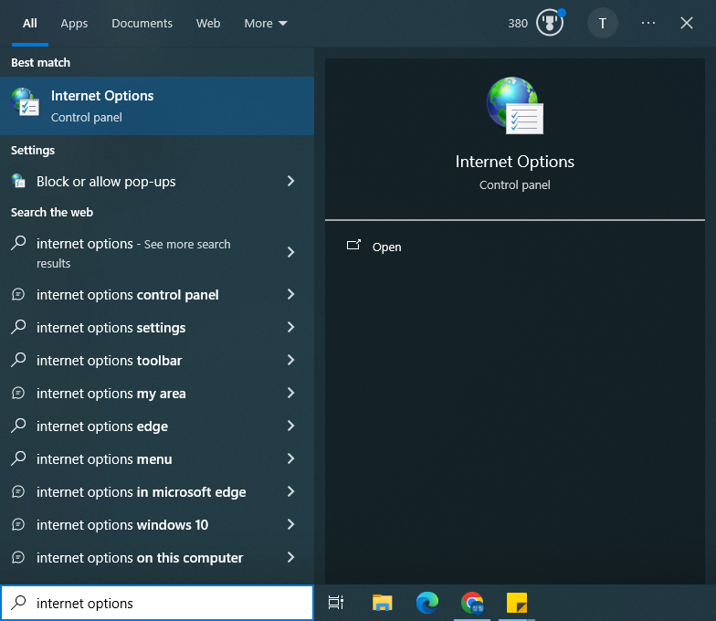
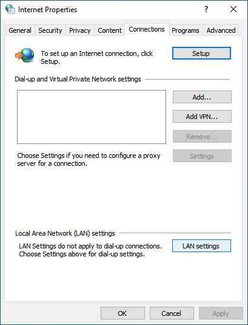
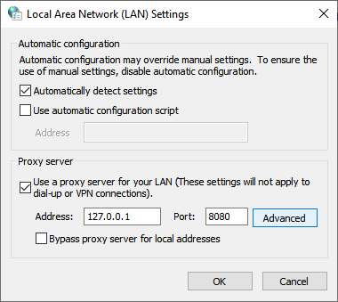
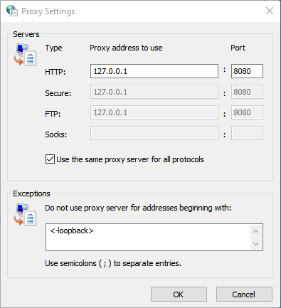
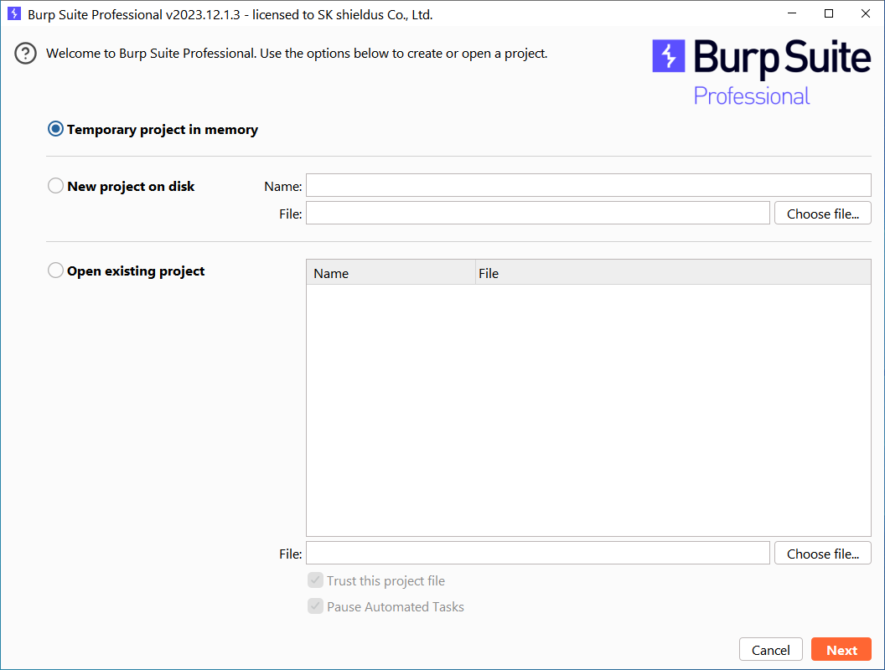
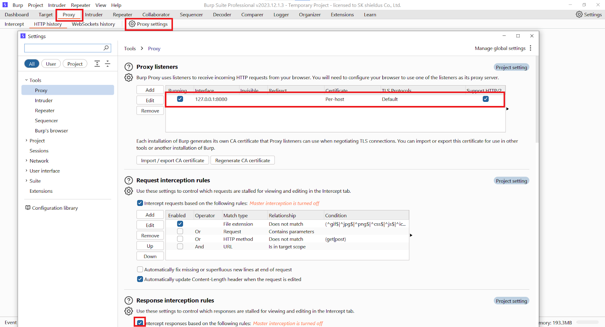
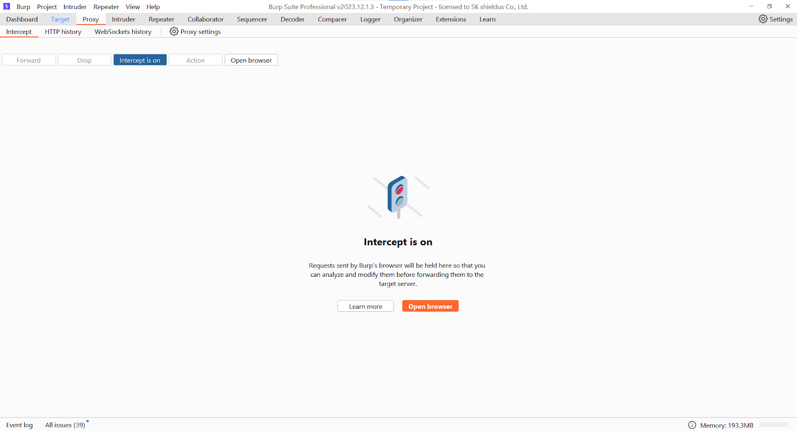
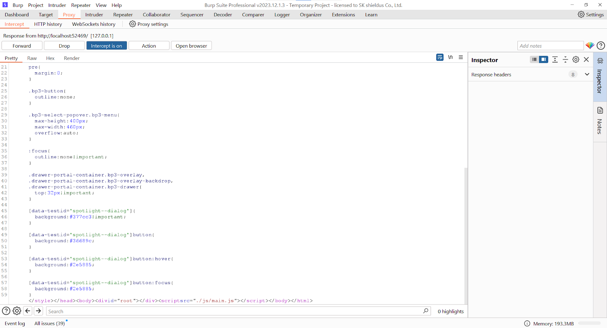
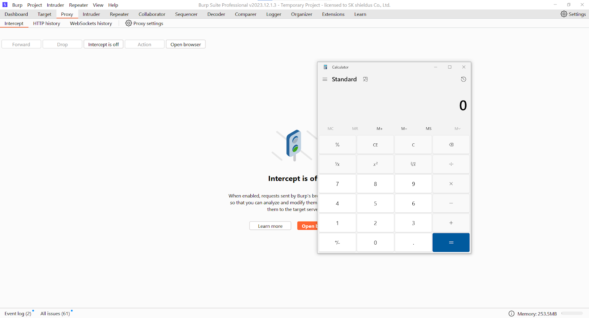

# YANA Notebook PoC
A Proof-Of-Concept for CVE-2024-23997 vulnerability.
#### 1. Vunerability Overview:
* Vulnerability Subject: Local Code Excution via XSS
* Vulnerability Version: =< 1.0.16
* Attack Type: Remote Code Execution
* Attack Vectors: To exploit the vulnerability, we must intercept an HTTP packet using the Electron main window. Next, we have to inject malicious scripts into the HTML that we intercept. When Electron makes the main window of the Yana notebook, the scripts will be executed, and we can run OS commands. If the program runs with admin privileges, the OS commands will run with admin privileges. Therefore, it also has a vulnerability to privilege escalation.
* Reserved CVE Number: CVE-2024-23997

#### 2. Vulnerability Cause:
cf) A proxy, especially a web proxy, acts as an agent in the middle of web communication, receiving and forwarding requests and responses on behalf of others. So, regardless of the port YANA uses, a proxy can intercept the communication. While proxies are used for security or to increase search speed through caching, many malicious programs exploit them to eavesdrop on the web communications users send.

Let's look at one example using YANA. I installed Burp Suite, a proxy tool that acts as malware, on my Windows 10 to set up a practice environment. Burp Suite is a network security diagnostic tool from PortSwigger, and its community version is available for free. If you want to follow this example, please note that changes to network settings are required for the practice, so restoration is necessary.
  
Step 1) Actual malware does not change Internet settings but listens to packets using Windows API, Linux API, etc. However, due to its complexity, options are activated manually. Press the Windows key and search for Internet Options.\

  
Step 2) Go to the Connections tab, and Click the LAN settings button.\

  
Step 3) Check “Use a proxy server for your LAN”, and Click the Advanced button. To restore settings, simply uncheck.\

  
Step 4) Modify the content of HTTP in Servers to “127.0.0.1”, “8080”, and Exceptions to “<-loopback>” and click the OK buttons for saving option.\

  
Step 5) Open the Burp Suite.\

  
Step 6) Since we will only be verifying, check “Temporary project in memory” and click the Next button.\

  
Step 7) Select “Use Burp defaults” and click the Start Burp button.\

  
Step 8) Go to the Proxy tab, then click on Proxy settings to check if the proxy is set to 127.0.0.1:8080 in Proxy listeners and verify that Running is checked. Also, go to Response interception rules under Proxy listeners and check Intercept response based on the following rules. When you close the settings window, the options are applied automatically.\

  
Step 9) Go to the Intercept tab in the Proxy and verify that “Intercept is on”, then open Yana. When Intercept is enabled, all HTTP/HTTPS communications are held and not sent to the other party until Intercept is disabled or Forward is pressed.\

  
Step 10) While pressing the Forward button, look for HTML responses among the responses received from the Yana background server. It's easy to distinguish because the title tag of the HTML document is written as Yana.\

  
Step 11) Insert the JS code(`“”`) using a script tag under the HTML body tag.\

  
Step 12) Then, disable “Intercept is on”, and the Yana Electron program will receive packets and execute the script, launching the calculator program.\

  
Step 13) Once the practice is completed, go to Internet options and disable the use of Proxy server.\

  
This is because the nodeIntegration option is enabled in Yana. Even if this option is disabled, executing Node.js code from HTML becomes possible using various other methods. If executed with Yana's permissions, and if Yana is running with administrator or root permissions, the injected malicious code can be executed with those permissions. Therefore, as previously mentioned, it is safer to fetch and display HTML pages using protocols like the File protocol, which are more difficult to intercept in inter-program communication, rather than using the HTTP protocol.
